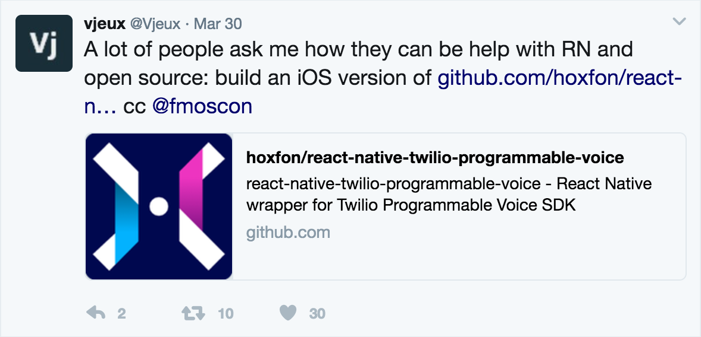

# react-native-twilio-programmable-voice
This is a React Native wrapper for Twilio Programmable Voice SDK that lets you make and receive calls from your ReactNatvie App. This module is not curated nor maintained, but inspired by Twilio.

# Twilio Programmable Voice SDK

- Android 2.0.7 (bundled within this library)
- iOS 2.0.4 (specified by the app's own podfile)

## Breaking changes in v3.0.0

- initWitToken returns an object with a property `initialized` instead of `initilized`
- iOS event `connectionDidConnect` returns the same properties as Android
move property `to` => `call_to`
move property `from` => `call_from`

## Migrating Android from v1 to v2 (incoming call use FCM)

You will need to make changes both on your Twilio account using Twilio Web Console and on your react native app.
Twilio Programmable Voice Android SDK uses `FCM` since version 2.0.0.beta5.

Before you start, I strongly suggest that you read the list of Twilio changes from Android SDK v2.0.0 beta4 to beta5:
[Twilio example App: Migrating from GCM to FCM](https://github.com/twilio/voice-quickstart-android/blob/d7d4f0658e145eb94ab8f5e34f6fd17314e7ab17/README.md#migrating-from-gcm-to-fcm)

These are all the changes required:

- remove all the GCM related code from your `AndroidManifest.xml` and add the following code to receive `FCM` notifications
(I wasn't successful in keeping react-native-fcm working at the same time. If you know how please open an issue to share).

```xml
    .....

    <!-- Twilio Voice -->
    <!-- [START fcm_listener] -->
    <service
        android:name="com.hoxfon.react.TwilioVoice.fcm.VoiceFirebaseMessagingService">
        <intent-filter>
            <action android:name="com.google.firebase.MESSAGING_EVENT" />
        </intent-filter>
    </service>
    <!-- [END fcm_listener] -->
    <!-- [START instanceId_listener] -->
    <service
        android:name="com.hoxfon.react.TwilioVoice.fcm.VoiceFirebaseInstanceIDService"
        android:exported="false">
        <intent-filter>
            <action android:name="com.google.android.gms.iid.InstanceID" />
        </intent-filter>
    </service>
    <!-- [END instanceId_listener] -->
    <!-- Twilio Voice -->
```

- log into your Firebase console. Navigate to: Project settings > CLOUD MESSAGING. Copy your `Server key`
- in Twilio console add a new Push Credential, type `FCM`, fcm secret Firebase FCM `Server key`
- include in your project `google-services.json`; if you have not include it yet
- rename getIncomingCall() to getActiveCall()

If something doesn't work as expected or you want to make a request open an issue.

## Help wanted!

There is no need to ask permissions to contribute. Just open an issue or provide a PR. Everybody is welcome to contribute.

ReactNative success is directly linked to its module ecosystem. One way to make an impact is helping contributing to this module or another of the many community lead ones.



## Installation

Before starting, we recommend you get familiar with [Twilio Programmable Voice SDK](https://www.twilio.com/docs/api/voice-sdk).
It's easier to integrate this module into your react-native app if you follow the Quick start tutorial from Twilio, because it makes very clear which setup steps are required.


```
npm install react-native-twilio-programmable-voice --save
react-native link react-native-twilio-programmable-voice
```

### iOS Installation - when projects made with react-native init
After you have linked the library with `react-native link react-native-twilio-programmable-voice`
check that `libRNTwilioVoice.a` is present under YOUR_TARGET > Build Phases > Link Binaries With Libraries. If it is not present you can add it using the + sign at the bottom of that list.

Edit your `Podfile` to include TwilioVoice framework

```
source 'https://github.com/cocoapods/specs'

# min version for TwilioVoice to work
platform :ios, '8.1'

target <YOUR_TARGET> do
    ...
    pod 'TwilioVoice', '~> 2.1.0'
    ...
end

```

run `pod install` from inside your project `ios` directory

### iOS Installation - when projects made without react-native init
Edit your `Podfile` to include TwilioVoice and RNTwilioVoice frameworks

```
source 'https://github.com/cocoapods/specs'

# min version for TwilioVoice to work
platform :ios, '8.1'

target <YOUR_TARGET> do
    ...
    pod 'TwilioVoice', '~> 2.1.0'
    pod 'RNTwilioVoice', path: '../node_modules/react-native-twilio-programmable-voice'
    ...
end

```

run `pod install` from inside your project `ios` directory

### CallKit

The current iOS part of this library works through [CallKit](https://developer.apple.com/reference/callkit). Because of this the call flow is much simpler than on Android as CallKit handles the inbound calls answering, ignoring, or rejecting.
Because of CallKit, the only event listeners present are "deviceReady", "connectionDidConnect", "connectionDidDisconnect", and "callRejected".

### VoIP Service Certificate

Twilio Programmable Voice for iOS utilizes Apple's VoIP Services and VoIP "Push Notifications" instead of FCM. You will need a VoIP Service Certificate from Apple to receive calls.


## Android Installation

Setup FCM

You must download the file `google-services.json` from the Firebase console.
It contains keys and settings for all your applications under Firebase. This library obtains the resource `senderID` for registering for remote GCM from that file.

**NOTE: To use a specific `play-service-gcm` version, update the `compile` instruction in your App's `android/app/build.gradle` (replace `10.+` with the version you prefer):**

```gradle
...

buildscript {
  ...
  dependencies {
    classpath 'com.google.gms:google-services:3.1.2'
  }
}

...

dependencies {
    ...

    compile project(':react-native-twilio-programmable-voice')
}

// this plugin looks for google-services.json in your project
apply plugin: 'com.google.gms.google-services'
```

In your `AndroidManifest.xml`

```xml
    .....
    <uses-permission android:name="android.permission.VIBRATE" />


    <application ....>

        ....

        <!-- Twilio Voice -->
        <!-- [START fcm_listener] -->
        <service
            android:name="com.hoxfon.react.RNTwilioVoice.fcm.VoiceFirebaseMessagingService">
            <intent-filter>
                <action android:name="com.google.firebase.MESSAGING_EVENT" />
            </intent-filter>
        </service>
        <!-- [END fcm_listener] -->
        <!-- [START instanceId_listener] -->
        <service
            android:name="com.hoxfon.react.RNTwilioVoice.fcm.VoiceFirebaseInstanceIDService"
            android:exported="false">
            <intent-filter>
                <action android:name="com.google.android.gms.iid.InstanceID" />
            </intent-filter>
        </service>
        <!-- [END instanceId_listener] -->
        <!-- Twilio Voice -->

     .....

```

In `android/settings.gradle`

```gradle
...

include ':react-native-twilio-programmable-voice'
project(':react-native-twilio-programmable-voice').projectDir = file('../node_modules/react-native-twilio-programmable-voice/android')
```

Register module (in `MainApplication.java`)

```java
import com.hoxfon.react.RNTwilioVoice.TwilioVoicePackage;  // <--- Import Package

public class MainApplication extends Application implements ReactApplication {

    private final ReactNativeHost mReactNativeHost = new ReactNativeHost(this) {
        @Override
        protected boolean getUseDeveloperSupport() {
            return BuildConfig.DEBUG;
        }

        @Override
        protected List<ReactPackage> getPackages() {
            return Arrays.<ReactPackage>asList(
                new MainReactPackage(),
                new TwilioVoicePackage()         // <---- Add the Package : by default it will ask microphone permissions
                // new TwilioVoicePackage(false) // <---- pass false to handle microphone permissions in your application
            );
        }
    };
    ....
}
```

## Usage

```javascript
import TwilioVoice from 'react-native-twilio-programmable-voice'

// ...

// initialize the Programmable Voice SDK passing an access token obtained from the server.
// Listen to deviceReady and deviceNotReady events to see whether the initialization succeeded.
async function initTelephony() {
    try {
        const accessToken = await getAccessTokenFromServer()
        const success = await TwilioVoice.initWithToken(accessToken)
    } catch (err) {
        console.err(err)
    }
}
 // iOS Only
function initTelephonyWithUrl(url) {
    TwilioVoice.initWithTokenUrl(url)
    try {
        TwilioVoice.configureCallKit({
            appName:       'TwilioVoiceExample',                  // Required param
            imageName:     'my_image_name_in_bundle',             // OPTIONAL
            ringtoneSound: 'my_ringtone_sound_filename_in_bundle' // OPTIONAL
        })
    } catch (err) {
        console.err(err)
    }
}
```

## Events

```javascript
// add listeners (flowtype notation)
TwilioVoice.addEventListener('deviceReady', function() {
    // no data
})
TwilioVoice.addEventListener('deviceNotReady', function(data) {
    // {
    //     err: string
    // }
})
TwilioVoice.addEventListener('connectionDidConnect', function(data) {
    // Android
    // {
    //     call_sid: string,  // Twilio call sid
    //     call_state: 'PENDING' | 'CONNECTED' | 'ACCEPTED' | 'CONNECTING' 'DISCONNECTED' | 'CANCELLED',
    //     call_from: string, // "+441234567890"
    //     call_to: string,   // "client:bob"
    // }
    // iOS
    // {
    //     call_sid: string,  // Twilio call sid
    //     call_state: 'PENDING' | 'CONNECTED' | 'ACCEPTED' | 'CONNECTING' 'DISCONNECTED' | 'CANCELLED',
    //     from: string,      // "+441234567890" // issue 44 (https://github.com/hoxfon/react-native-twilio-programmable-voice/issues/44)
    //     to: string,        // "client:bob"    // issue 44 (https://github.com/hoxfon/react-native-twilio-programmable-voice/issues/44)
    // }
})
TwilioVoice.addEventListener('connectionDidDisconnect', function(data: mixed) {
    //   | null
    //   | {
    //       err: string
    //     }
    //   | Android
    //     {
    //         call_sid: string,  // Twilio call sid
    //         call_state: 'PENDING' | 'CONNECTED' | 'ACCEPTED' | 'CONNECTING' 'DISCONNECTED' | 'CANCELLED',
    //         call_from: string, // "+441234567890"
    //         call_to: string,   // "client:bob"
    //         err?: string,
    //     }
    //   | iOS
    //     {
    //         call_sid: string,  // Twilio call sid
    //         call_state: 'PENDING' | 'CONNECTED' | 'ACCEPTED' | 'CONNECTING' 'DISCONNECTED' | 'CANCELLED',
    //         call_from?: string, // "+441234567890"
    //         call_to?: string,   // "client:bob"
    //         from?: string,      // "+441234567890" // issue 44 (https://github.com/hoxfon/react-native-twilio-programmable-voice/issues/44)
    //         to?: string,        // "client:bob"    // issue 44 (https://github.com/hoxfon/react-native-twilio-programmable-voice/issues/44)
    //         error?: string,                        // issue 44 (https://github.com/hoxfon/react-native-twilio-programmable-voice/issues/44)
    //     }
})

// iOS Only
TwilioVoice.addEventListener('callRejected', function(value: 'callRejected') {})

// Android Only
TwilioVoice.addEventListener('deviceDidReceiveIncoming', function(data) {
    // {
    //     call_sid: string,  // Twilio call sid
    //     call_state: 'PENDING' | 'CONNECTED' | 'ACCEPTED' | 'CONNECTING' 'DISCONNECTED' | 'CANCELLED',
    //     call_from: string, // "+441234567890"
    //     call_to: string,   // "client:bob"
    // }
})
// Android Only
TwilioVoice.addEventListener('proximity', function(data) {
    // {
    //     isNear: boolean
    // }
})
// Android Only
TwilioVoice.addEventListener('wiredHeadset', function(data) {
    // {
    //     isPlugged: boolean,
    //     hasMic: boolean,
    //     deviceName: string
    // }
})

// ...

// start a call
TwilioVoice.connect({To: '+61234567890'})

// hangup
TwilioVoice.disconnect()

// accept an incoming call (Android only, in iOS CallKit provides the UI for this)
TwilioVoice.accept()

// reject an incoming call (Android only, in iOS CallKit provides the UI for this)
TwilioVoice.reject()

// ignore an incoming call (Android only)
TwilioVoice.ignore()

// mute or un-mute the call
// mutedValue must be a boolean
TwilioVoice.setMuted(mutedValue)

TwilioVoice.sendDigits(digits)

// should be called after the app is initialized
// to catch incoming call when the app was in the background
TwilioVoice.getActiveCall()
    .then(incomingCall => {
        if (incomingCall){
            _deviceDidReceiveIncoming(incomingCall)
        }
    })
```

## Twilio Voice SDK reference

[iOS changelog](https://www.twilio.com/docs/api/voice-sdk/ios/changelog)

[Android changelog](https://www.twilio.com/docs/api/voice-sdk/android/changelog)

## Credits

[voice-quickstart-android](https://github.com/twilio/voice-quickstart-android)

[react-native-push-notification](https://github.com/zo0r/react-native-push-notification)

[voice-quickstart-objc](https://github.com/twilio/voice-quickstart-objc)


## License

MIT
